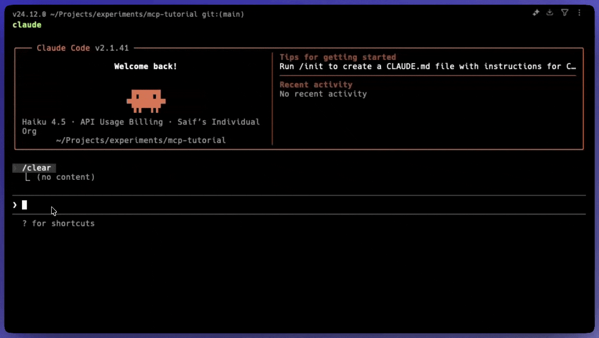

<div align="center">


<p><strong>Scalekit Auth Plugins for Claude Code — the auth stack for agents.</strong><br>
Add SSO, SCIM, MCP Auth, agent auth, and tool-calling from your Claude Code editor.</p>

[](./LICENSE)
[](https://github.com/scalekit-inc/claude-code-authstack/pulls)

**[📖 Documentation](https://docs.scalekit.com)** · **[💬 Slack](https://join.slack.com/t/scalekit-community/shared_invite/zt-3gsxwr4hc-0tvhwT2b_qgVSIZQBQCWRw)**

</div>

---

Setting up auth for B2B and AI apps is complex. Between auth flows, SSO providers, SCIM provisioning, MCP auth, and securing AI agents, most developers spend weeks on auth instead of shipping features with confidence.

This plugin adds the complete Scalekit auth stack to your projects — whether that's a B2B app, AI agent, or MCP server — directly from Claude Code.



---

### Installation

```sh
# Start Claude REPL
claude

# Add Scalekit Auth Stack marketplace
/plugin marketplace add scalekit-inc/claude-code-authstack

# Run the plugins wizard
/plugins
```

---

### Available Plugins

| Plugin | Description |
|--------|-------------|
| **MCP Auth** | Add OAuth 2.1 authorization to Model Context Protocol servers. Guides you through token handling, refresh flows, and scope management. |
| **Modular SSO** | Integrate enterprise SSO providers (Okta, JumpCloud, Entra ID, etc.). Support 20+ identity providers without writing SAML parsers. |
| **Modular SCIM** | Enable user provisioning and directory sync. Let customers provision users automatically from their identity provider. |
| **Full Stack Auth** | Complete authentication setup for web applications. End-to-end auth including login pages, session management, and protected routes. |
| **Agent Auth** | Secure authentication for AI agents and services. OAuth flows designed for AI agents with token persistence and refresh logic. |

---

### Quick Start

After adding the marketplace, install a plugin based on your use case:

#### For MCP Servers

```sh
/plugin install mcp-auth@scalekit-auth-stack
```

Use this to secure your MCP servers with OAuth 2.1 authorization.

#### For Enterprise SSO

```sh
/plugin install modular-sso@scalekit-auth-stack
```

Use this to add SAML/OIDC SSO with providers like Okta, JumpCloud, or Entra ID.

#### For AI Agents

```sh
/plugin install agent-auth@scalekit-auth-stack
```

Use this to add authentication for AI agents that act on behalf of users.

#### For User Provisioning

```sh
/plugin install modular-scim@scalekit-auth-stack
```

Use this to enable SCIM directory sync for automatic user provisioning.

#### For Full-stack App Authentication

```sh
/plugin install full-stack-auth@scalekit-auth-stack
```

Use this to add login, callback handling, sessions, and logout flows to web apps.

---

### Repository Structure

```
.
├── plugins/
│   ├── mcp-auth/         # OAuth 2.1 for MCP servers
│   ├── modular-sso/      # Enterprise SSO integration
│   ├── modular-scim/     # SCIM provisioning
│   ├── full-stack-auth/  # Complete web app auth
│   └── agent-auth/       # AI agent authentication
├── images/               # Documentation images
├── AGENTS.md             # Contribution guidelines
└── LICENSE               # MIT License
```

---

### Prerequisites

- [Scalekit account](https://scalekit.com) with `client_id` and `client_secret`
- Claude Code installed and configured
- Project where you want to add authentication

---

### Helpful Links

#### Documentation

- [Scalekit Documentation](https://docs.scalekit.com) — Complete guides and API reference
- [Build with AI overview](https://docs.scalekit.com/dev-kit/build-with-ai/) — Claude, Codex, Copilot CLI, Cursor setup flows
- [Modular SSO guide](https://docs.scalekit.com/authenticate/sso/add-modular-sso/) — Implement enterprise SSO
- [MCP Auth guide](https://docs.scalekit.com/authenticate/mcp/quickstart/) — Secure MCP servers
- [Full-stack auth guide](https://docs.scalekit.com/authenticate/fsa/quickstart/) — Add login, callback, and session management
- [SCIM directory sync guide](https://docs.scalekit.com/directory/scim/quickstart/) — Provision and deprovision users
- [Agent Auth Guide](https://docs.scalekit.com/agent-auth/quickstart/) — Authentication for AI agents

#### Resources

- [Admin Portal](https://app.scalekit.com) — Manage your Scalekit account
- [API Reference](https://docs.scalekit.com/apis) — Complete API documentation
- [Code Examples](https://docs.scalekit.com/directory/code-examples/) — Ready-to-use snippets

---

### Contributing

Contributions are welcome! Please see [AGENTS.md](AGENTS.md) for contribution guidelines.

1. Fork this repository
2. Create a branch — `git checkout -b feature/my-plugin`
3. Make your changes following the plugin structure in AGENTS.md
4. Test locally
5. Open a Pull Request

---

### License

This project is licensed under the **MIT license**. See the [LICENSE](LICENSE) file for more information.
