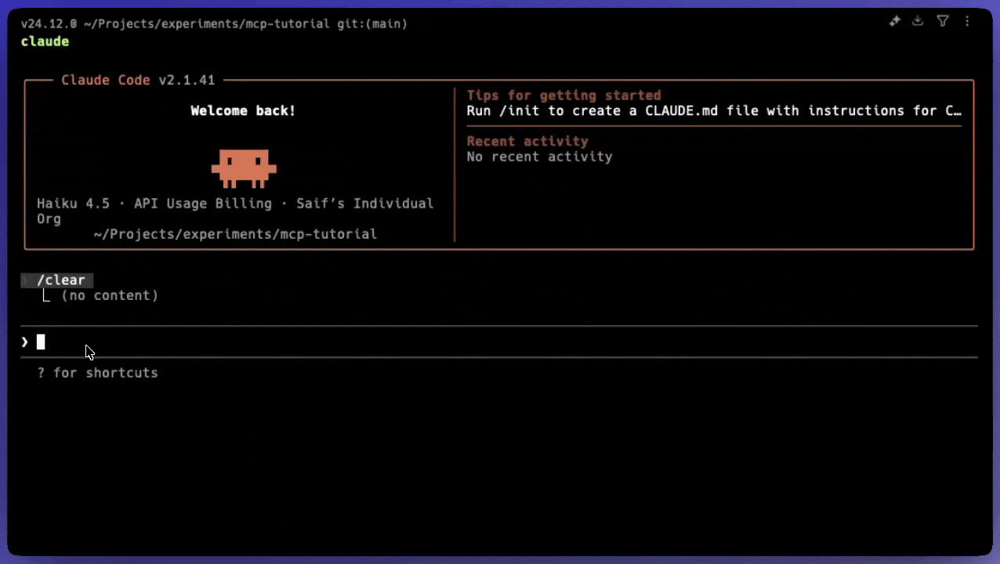

<div align="center">


<p><strong>Scalekit Auth Stack for Claude Code — AgentKit and SaaSKit plugins.</strong><br>
Add agent auth, tool calling, SSO, SCIM, MCP auth, and session management from Claude Code.</p>

[](./LICENSE)
[](https://github.com/scalekit-inc/claude-code-authstack/pulls)

**[📖 Documentation](https://docs.scalekit.com)** · **[📋 LLM Docs](https://docs.scalekit.com/llms.txt)** · **[💬 Slack](https://join.slack.com/t/scalekit-community/shared_invite/zt-3gsxwr4hc-0tvhwT2b_qgVSIZQBQCWRw)**

</div>

---

Setting up auth for B2B and AI apps is complex. Between agent OAuth flows, SSO providers, SCIM provisioning, MCP server auth, and session management, most developers spend weeks on auth instead of shipping features.

This marketplace adds the complete Scalekit auth stack to your projects — whether that's an AI agent, a B2B SaaS app, or an MCP server — directly from Claude Code.



---

### Installation

```sh
# One-line installer
curl -fsSL https://raw.githubusercontent.com/scalekit-inc/claude-code-authstack/main/install.sh | bash
```

Or install manually inside Claude Code:

```sh
# Start Claude REPL
claude

# Add Scalekit Auth Stack marketplace
/plugin marketplace add scalekit-inc/claude-code-authstack

# Install a plugin
/plugin install agentkit@scalekit-auth-stack
/plugin install saaskit@scalekit-auth-stack

# Open the plugins wizard
/plugins
```

After installation, enable auto-update:

1. Open `/plugins`
2. Go to `Marketplaces`
3. Select `scalekit-auth-stack`
4. Enable `auto-update`

---

### Available Plugins

| Plugin | Description |
|--------|-------------|
| **AgentKit** | Authentication for AI agents. OAuth flows, token vault, 100+ connectors (Gmail, Slack, Salesforce, etc.), tool discovery, and live testing — so agents can act on behalf of users. |
| **SaaSKit** | Production-ready auth for B2B SaaS apps. Login, sessions, SSO (Okta, Azure AD, Google), SCIM provisioning, RBAC, MCP server auth, and API key management. |

---

### Quick Start

#### For AI Agents

```sh
/plugin install agentkit@scalekit-auth-stack
```

Use AgentKit to add authentication for AI agents that connect to third-party services, discover tools, and execute authenticated actions on behalf of users.

#### For B2B SaaS Apps

```sh
/plugin install saaskit@scalekit-auth-stack
```

Use SaaSKit to add login, session management, enterprise SSO, SCIM provisioning, RBAC, MCP server auth, and API key management to web applications.

---

### Repository Structure

```
.
├── plugins/
│   ├── agentkit/         # AI agent authentication (AgentKit)
│   └── saaskit/          # B2B SaaS authentication (SaaSKit)
├── images/               # Documentation images
├── scripts/              # Install scripts
├── AGENTS.md             # Contribution guidelines
└── LICENSE               # MIT License
```

---

### Prerequisites

- [Scalekit account](https://scalekit.com) with `client_id` and `client_secret`
- Claude Code installed and configured
- Project where you want to add authentication

> **Windows**: `install.sh` requires macOS or Linux (or WSL on Windows). Native Windows PowerShell install is not yet supported.

---

### Helpful Links

#### Documentation

- [Scalekit Documentation](https://docs.scalekit.com) — Complete guides and API reference
- [LLM docs map](https://docs.scalekit.com/llms.txt) — High-level index of published Scalekit documentation sets
- [Docs sitemap](https://docs.scalekit.com/sitemap-0.xml) — Stable sitemap for discovering published docs pages
- [Build with AI overview](https://docs.scalekit.com/dev-kit/build-with-ai/) — Claude, Codex, Copilot CLI, Cursor setup flows
- [Modular SSO guide](https://docs.scalekit.com/authenticate/sso/add-modular-sso/) — Implement enterprise SSO
- [MCP Auth guide](https://docs.scalekit.com/authenticate/mcp/quickstart/) — Secure MCP servers
- [Full-stack auth guide](https://docs.scalekit.com/authenticate/fsa/quickstart/) — Add login, callback, and session management
- [SCIM directory sync guide](https://docs.scalekit.com/directory/scim/quickstart/) — Provision and deprovision users
- [AgentKit overview](https://docs.scalekit.com/agentkit/overview) — Connect agents to authenticated tools through connectors, connections, and connected accounts
- [AgentKit quickstart](https://docs.scalekit.com/agentkit/quickstart) — Build an agent that makes authenticated tool calls on behalf of users

#### Resources

- [Admin Portal](https://app.scalekit.com) — Manage your Scalekit account
- [API Reference](https://docs.scalekit.com/apis) — Complete API documentation
- [Code Examples](https://docs.scalekit.com/directory/code-examples/) — Ready-to-use snippets

---

### Contributing

Contributions are welcome! Please see [AGENTS.md](AGENTS.md) for contribution guidelines.

1. Fork this repository
2. Create a branch — `git checkout -b feature/my-plugin`
3. Make your changes following the plugin structure in AGENTS.md
4. Test locally
5. Open a Pull Request

---

### License

This project is licensed under the **MIT license**. See the [LICENSE](LICENSE) file for more information.
